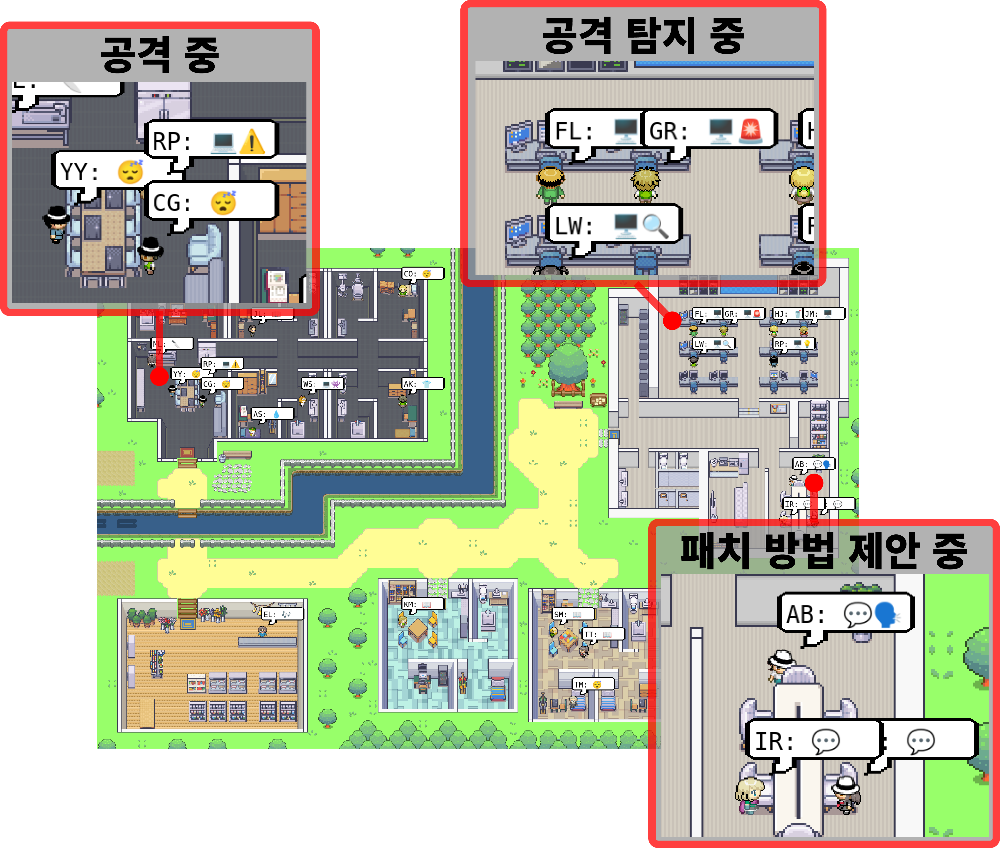

# LLM을 활용한 해킹 공격 및 방어 시뮬레이션 환경 구축




## Development Environment

| Component    | Details                                           |
|--------------|---------------------------------------------------|
| OS           | `Windows 11`, `WSL(Ubuntu 22.04)`, `Ubuntu 24.04` |
| Language     | `Python 3.12.5`                                   |
| GPU (Memory) | NVIDIA GeForce RTX 3060 (12GB)                    |


## Installation

도커를 사용하여 안전하게 격리된 환경을 구성하는 것을 권장합니다.

내용 중 `<이 부분>`은 모두 상황에 맞게 수정해 주세요.


### Docker

> [!NOTE]
> 도커 이미지에 대한 자세한 사용법은
> [프로젝트 전용 이미지](https://github.com/JustPersona/generative-agents-docker)
> 를 참고해 주세요

도커를 사용하여 프로젝트 서버를 쉽게 구성할 수 있습니다.

새 폴더를 만들고 아래 두 파일을 먼저 생성합니다.

- [docker-compose.yml](https://github.com/JustPersona/generative-agents/blob/main/docker-compose.yml)
- [.env](https://github.com/JustPersona/generative-agents/blob/main/example.env)

필요한 경우 추가 설정을 하고, 모든 설정을 마쳤다면
`docker-compose.yml` 파일이 위치한 곳에서 아래 명령어를 실행하여 서버 구성을 시작합니다.

```shell
docker compose up -d
```

이 외 다른 명령어는 [여기](https://github.com/JustPersona/generative-agents-docker/#key-commands)를 참고해 주세요.

#### Setup LLM

`.env` 파일 내 환경 변수 `OLLAMA_GGUF_DOWNLOAD_URL` 값을 설정하여 원하는 LLM을 프로젝트에서 사용할 수 있습니다.
이때 URL은 다운로드 가능한 파일의 URL이여야 합니다.

또는 `share` 폴더 생성 후 GGUF 파일을 직접 다운로드한 후 `OLLAMA_GGUF_PATH` 값을 파일명으로 설정하면
별도의 다운로드 없이 해당 파일을 사용하여 모델을 생성합니다.

두 방법 모두 `share` 폴더 내 `Modelfile`을 작성하면
모델 생성 시 같이 적용되어 커스텀 모델을 생성할 수 있습니다.

#### Setup Target Server

도커로 프로젝트 서버 구성 시 기본적으로 타겟 서버는
[DVWA](https://github.com/digininja/dvwa)가 사용됩니다.

DVWA 외 다른 서버를 타겟 서버로 지정하는 방법은 다음과 같습니다.

1. `docker-compose.yml` 파일 수정
    - DVWA 관련 설정 모두 삭제
    - `./source:/source:ro` 부분에서 `./source`를 타겟 서버의 소스코드가 위치한 경로로 변경
2. 타겟 서버를 구성하는 방법에 따라 설정 방법이 달라집니다.
    1. 프로젝트 서버와 타겟 서버 컨테이너를 같이 올리는 경우
        - `docker-compose.yml` 파일 내 서버를 실행하기 위한 설정 추가 작성 및 네트워크에 `generative_agents_internal`를 연결
    2. 이미 도커로 실행 중인 서버를 타겟 서버로 지정하는 경우
        - 프로젝트 서버 실행 후 아래 명령어로 타겟 서버 컨테이너를 프로젝트 네트워크와 연결

            ```shell
            docker network connect generative_agents_internal <container_name>
            ```

    3. 그 외의 서버를 타겟 서버로 사용하는 경우
        - `docker-compose.yml` 파일 내 `internal: true` 라인 삭제
        - 이 경우 프로젝트 서버가 외부로 접근할 수 있기 때문에 보안상 권장하지 않습니다.

#### Setup GPU

제공되는 `docker-compose.yml` 파일에는 기본적으로 GPU를 사용하도록 되어있습니다.

GPU가 없거나 사용하지 않도록 하고자 한다면, `deploy:`부터 `capabilities:` 라인까지 모두 삭제합니다.

만약 여러 개의 GPU를 사용한다면, `driver:` 아래에 `count: 1`과 같이 설정하여 지정된 GPU만 사용하도록 할 수 있습니다.


### Manually

> [!WARNING]
> 파이썬 버전이 `3.12.5`이 아닐 경우 에러가 발생할 수 있습니다.

다음은 도커가 아닌 수동으로 서버를 구성하는 방법입니다.

1. 소스코드 다운로드 후 해당 폴더로 이동
2. `pip install -Ur requirements.txt` 명령어를 실행하여 필요한 모듈 자동 설치
3. [DVWA](https://github.com/digininja/dvwa) 또는 별도의 서버로 타겟 서버 구성 및 실행
4. [Ollama](https://ollama.com/) 설치
5. LLM 모델 빌드
    - 사용하고자 하는 모델의 GGUF 파일을 다운로드
    - Modelfile 파일 생성 및 `FROM <File Name>.gguf` 작성 후 `ollama create <Model Name> -f Modelfile` 명령어 실행
6. `environment/frontend_server`에서 아래 명령어를 사용하여 프론트엔드 실행

    ```shell
    python3 manage.py migrate
    python3 manage.py runserver
    # python3 manage.py runserver 0.0.0.0:8000  # 외부 접속이 필요한 경우
    ```

7. `reverie/backend_server`로 이동 후 아래 명령어를 사용하여 백엔드 실행
    - 실행 전 [utils.py](#utilspy) 파일 작성 필수

    ```shell
    python3 reverie.py
    ```

### utils.py

백엔드를 실행하기 위해서는 아래와 같이 작성된 `utils.py` 파일을
`reverie/backend_server` 폴더 내 먼저 생성해아 합니다.

```python
# ollama
ollama_url = "http://<Ollama IP:11434>"
ollama_model = "<Model Name>"

# Target Server Info
dvwa_url = "http://<dvwa_ip:port/base>"
server_path = "<./path/to/source>"

maze_assets_loc = "../../environment/frontend_server/static/assets"
env_matrix = f"{maze_assets_loc}/%s/matrix"
env_visuals = f"{maze_assets_loc}/%s/visuals"

fs_storage = "../../environment/frontend_server/storage"
fs_temp_storage = "../../environment/frontend_server/temp_storage"

black_hats = ["Carlos Gomez", "Yuriko Yamamoto"]
white_hats = ["Abigail Chen", "Arthur Burton"]
server_owners = ["Isabella Rodriguez"]
work_areas = ["computer desk", "control screen"]

# Verbose
debug = True
```


## API

> [!TIP]
> <http://frontend_ip:port/api/> 및 하위 경로로 직접 접근할 수 있습니다.

시뮬레이션 진행 시 생성된 데이터와 백엔드 상태를 조회하는 기능만 제공합니다.

| 요청 경로                          | 응답 내용                                                |
|------------------------------------|----------------------------------------------------------|
| /api                               | /api/help (변경 예정)                                    |
| /api/help                          | API 라우팅 경로별 응답 설명                              |
| /api/running                       | 현재 진행 중인 시뮬레이션 정보                           |
| /api/pens                          | 시뮬레이션 목록 및 메타 데이터                           |
| /api/pens/\<pen_code>              | \<pen_code>의 메타 데이터                                |
| /api/pens/\<pen_code>/\<step>      | \<pen_code>의 스텝이 \<step>일 때 에이전트들의 행동 정보 |
| /api/pens/\<pen_code>/-1           | \<pen_code>의 모든 스텝에 대한 에이전트들의 행동 정보    |
| /api/pens/\<pen_code>/payloads     | \<pen_code>에서 생성된 페이로드 목록                     |
| /api/pens/\<pen_code>/patches      | \<pen_code>에서 생성된 모든 패치 제안 목록               |
| /api/pens/\<pen_code>/best         | \<pen_code>에서 생성된 선택된 패치 제안 목록             |
| /api/charts                        | 대시보드에서 제공되는 모든 차트 데이터                   |
| /api/charts/pens                   | 대시보드에서 제공되는 시뮬레이션별 데이터                |
| /api/charts/pens/\<pen_code>       | 대시보드에서 제공되는 \<pen_code> 데이터                 |
| /api/charts/urls                   | 대시보드에서 제공되는 URL별 차트 데이터                  |
| /api/charts/attacks                | 대시보드에서 제공되는 공격 유형별 차트 데이터            |
| /api/charts/attacks/\<attack_name> | 대시보드에서 제공되는 \<attack_name> 데이터              |


## Forked from

- [joonspk-research/generative_agents](http://github.com/joonspk-research/generative_agents)
- [nyoma-diamond/evaluating_generative_agents](https://github.com/nyoma-diamond/evaluating_generative_agents)
